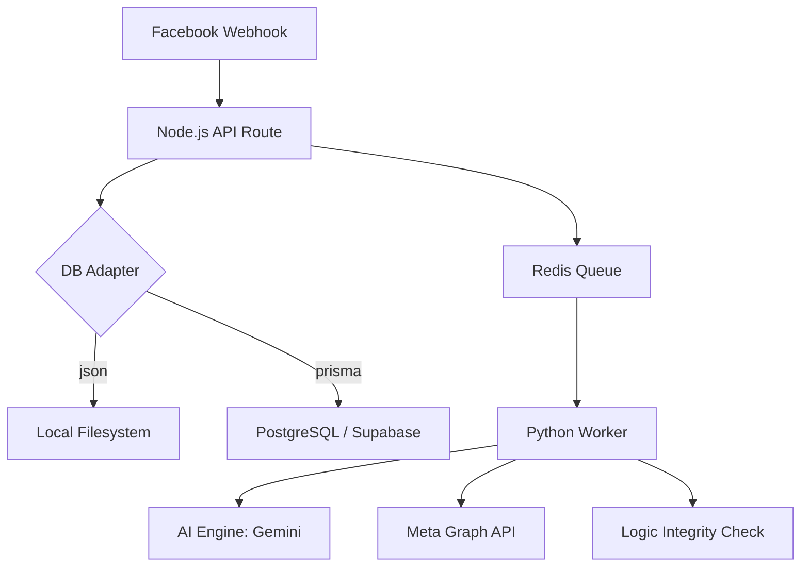

# CRM System Overview

## Architecture
The V-School CRM is built on a hybrid architecture that balances ease of use (JSON Flat Files) with professional reliability (PostgreSQL/Prisma).

### High-Level Component Diagram

## Key Modules
| Component | Responsibility | TECH STACK |
|-----------|----------------|------------|
| **Core API** | Routing, Auth, Webhooks | Next.js (Node.js) |
| **Data Layer** | Hybrid Adapter (JSON/Prisma) | File IO / Prisma ORM |
| **Worker Engine** | Long-running tasks, AI analysis | Python 3.12 |
| **Knowledge Base** | RAG, Semantic Search | ChromaDB / Vector Store |
| **Observability** | Error ID tracking & Resolution | `errorLogger.js` |

## Data Flows
1.  **Inbound Chat**: Webhook -> Node.js -> Redis -> Python Worker -> AI Analysis -> Reply.
2.  **Order Processing**: Dashboard -> Node.js API -> DB -> Timeline Event.
3.  **Error Handling**: Exception -> `logError()` -> DB/JSONL Fallback -> `incident_log.md`.

## Quality Assurance
We maintain data integrity via `src/workers/python/integrity_check.py` which scans for logic anomalies (e.g., misattributed campaign revenue).
