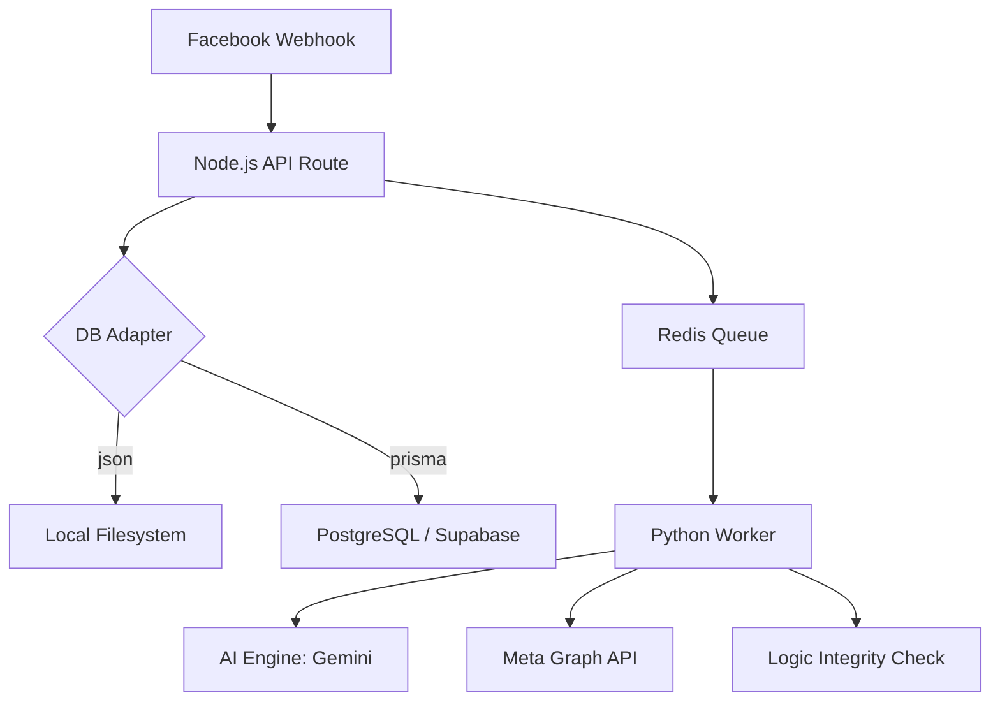

# CRM System Overview

## Architecture
The V-School CRM is built on a hybrid architecture that balances ease of use (JSON Flat Files) with professional reliability (PostgreSQL/Prisma).

### High-Level Component Diagram

## Key Modules
| Component | Responsibility | TECH STACK |
|-----------|----------------|------------|
| **Runtime Engine** | Portable execution environment | **Node.js (Local `node_env`)** |
| **Core API** | Routing, Auth, Webhooks | Next.js (Node.js) |
| **Data Layer** | Hybrid Adapter (JSON/Prisma) | File IO / Prisma ORM |
| **Worker Engine** | Python logic, AI, Tasks | Python 3.12 |
| **Knowledge Base** | Semantic Search (RAG) | JSON Vector Index / Gemini |
| **Observability** | Error Logging & Auditing | `errorLogger.js` / JSONL |

## 📂 File Structure Summary (Root)
| Path | Description |
|------|-------------|
| `crm-app/` | Main application source code |
| `node_env/` | **Portable Node.js Runtime** (Do not delete) |
| `MES/` | Future Spec: Manufacturing Execution System |
| `customer/` | Customer database (JSON) |
| `knowledge/` | AI Knowledge Base documents |
| `logs/` | System & Error logs |
| `รันระบบ_NextJS.command` | One-click Startup script |

## 📂 Internal App Structure (`crm-app/`)
| Path | Description |
|------|-------------|
| `src/app/api/` | Node.js API Routes (Entry points) |
| `src/workers/python/` | Core logic, AI Processing, Knowledge Base |
| `src/lib/` | Shared utilities (DB, Queue, Logging) |
| `prisma/` | Database schema and migrations |
| `marketing/` | Marketing logs and ROI data |
| `docs/adr/` | Architectural Decision Records |

## 🛡️ Observability & Reliability
The system implements a multi-layer logging strategy for maximum "Self-Healing" and traceability:

| Layer | Path | Purpose |
|-------|------|---------|
| **Error Logs** | `logs/errors_*.jsonl` | Technical failures (HTTP, DB, Tool errors). |
| **Audit Logs** | `logs/audit.jsonl` | Critical business actions (Records who did what). |
| **Marketing Logs** | `marketing/logs/` | Hourly snapshots of Ad performance for ROI analysis. |
| **Task Buffer** | `docs/tasks/` | Sliding window of the last 100 AI task executions. |
| **Incidents** | `docs/incidents/` | Detailed "Post-Mortems" for logic or system failures. |
| **Incident Index** | `docs/incident_log.md` | Human-readable index of all major system events. |

## 🔄 Core Data Flows
1.  **Inbound Chat**: Facebook Webhook -> `eventProducer.js` -> Redis -> `event_processor.py` -> Gemini AI -> Facebook Send API.
2.  **Order Processing**: Dashboard -> `db.js` Adapter -> (Prisma/PostgreSQL or JSON) -> Timeline Sync.
3.  **Knowledge Base (RAG)**: `knowledge_ingest.py` (Embeddings) -> `vector_index.json` -> `knowledge_base.py` (Search) -> AI Context.
4.  **Incident Lifecycle**: Anomaly Detected -> `incidentManager.js` -> Escalate Task context -> Generate MD Report -> Append to Master Log.

## 🛡️ Quality Assurance
1. **Logic Integrity**: `integrity_check.py` scans for attribution and business logic anomalies.
2. **Task Preservation**: Tasks involved in incidents are moved to `docs/tasks/permanent/` to prevent auto-deletion.
